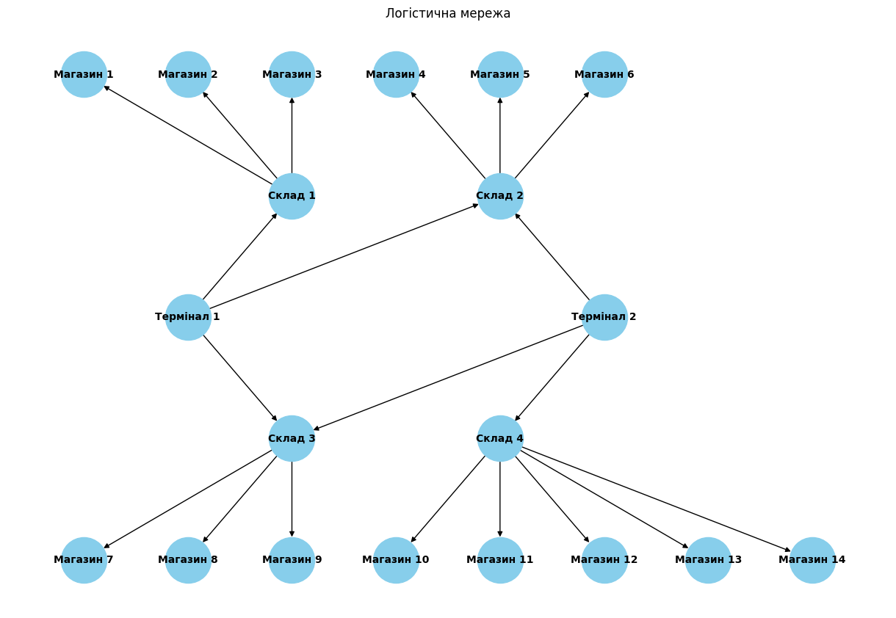

# goit-algo2-hw-03

**Design and Analysis of Algorithms. HW 3. Graphs and trees**

## Завдання 1. Застосування алгоритму максимального потоку для логістики товарів

Розробіть програму для моделювання мережі потоків для логістики товарів зі складів до магазинів, використовуючи алгоритм максимального потоку. Проведіть аналіз отриманих результатів і порівняйте їх з теоретичними знаннями.

**Опис завдання**

Побудуйте модель графа, що представляє мережу потоків у наступному зображені:



Зв'язки та пропускні здатності у графі мають наступний вигляд:

| **Від**    | **До**     | **Пропускна здатність (одиниць)** |
| ---------- | ---------- | --------------------------------- |
| Термінал 1 | Склад 1    | 25                                |
| Термінал 1 | Склад 2    | 20                                |
| Термінал 1 | Склад 3    | 15                                |
| Термінал 2 | Склад 3    | 15                                |
| Термінал 2 | Склад 4    | 30                                |
| Термінал 2 | Склад 2    | 10                                |
| Склад 1    | Магазин 1  | 15                                |
| Склад 1    | Магазин 2  | 10                                |
| Склад 1    | Магазин 3  | 20                                |
| Склад 2    | Магазин 4  | 15                                |
| Склад 2    | Магазин 5  | 10                                |
| Склад 2    | Магазин 6  | 25                                |
| Склад 3    | Магазин 7  | 20                                |
| Склад 3    | Магазин 8  | 15                                |
| Склад 3    | Магазин 9  | 10                                |
| Склад 4    | Магазин 10 | 20                                |
| Склад 4    | Магазин 11 | 10                                |
| Склад 4    | Магазин 12 | 15                                |
| Склад 4    | Магазин 13 | 5                                 |
| Склад 4    | Магазин 14 | 10                                |

Застосуйте алгоритм максимального потоку для вирішення задачі. Напишіть програму, що реалізує `алгоритм Едмондса-Карпа`, або скористайтеся вже реалізованою версією для знаходження максимального потоку в побудованому графі. Проведіть аналіз отриманого результату. Чи досягнуто оптимального потоку, і що це означає для розглянутої мережі?
Оформіть звіт з розрахунками та поясненнями. Поясніть, які вершини та ребра було вибрано, як вони відповідають реальним елементам логістичної системи. Покажіть покроковий розрахунок максимального потоку та пояснити логіку кожного кроку.

**Технічні умови**

1. Використовуйте `алгоритм Едмондса-Карпа` для реалізації максимального потоку.
2. Побудова графа повинна відповідати наведеній структурі з 20 вершинами та заданими пропускними здатностями.

## Звіт з розрахунками та поясненнями до завдання 1

### Вступ

Метою цього завдання було застосування алгоритму Едмондса-Карпа для розрахунку максимального потоку в логістичній мережі. Логістична система представлена графом, що складається з терміналів, складів і магазинів. У кожному ребрі графа задано пропускну здатність, яка відповідає максимально можливій кількості товарів, що можуть бути передані між двома вузлами.

### Граф побудовано в наступному вигляді

**Вершини**

Термінали: Термінал 1, Термінал 2.
Склади: Склад 1, Склад 2, Склад 3, Склад 4.
Магазини: Магазини 1–14.

**Ребра**

Ребра відповідають транспортним маршрутам між терміналами, складами та магазинами з відповідними пропускними здатностями.

### Алгоритм Едмондса-Карпа

Алгоритм базується на пошуку найкоротших шляхів у графі за допомогою BFS (пошуку в ширину) та поступовому збільшенні потоку до досягнення максимуму.

### Таблиця результатів

Загальний максимальний потік: 115 одиниць.

| **Термінал** | **Магазин** | **Фактичний Потік (одиниць)** |
| ------------ | ----------- | ----------------------------- |
| Термінал 1   | Магазин 1   | 15                            |
| Термінал 1   | Магазин 2   | 10                            |
| Термінал 1   | Магазин 3   | 0                             |
| Термінал 1   | Магазин 4   | 15                            |
| Термінал 1   | Магазин 5   | 10                            |
| Термінал 1   | Магазин 6   | 5                             |
| Термінал 1   | Магазин 7   | 15                            |
| Термінал 1   | Магазин 8   | 10                            |
| Термінал 1   | Магазин 9   | 0                             |
| Термінал 1   | Магазин 10  | 0                             |
| Термінал 1   | Магазин 11  | 0                             |
| Термінал 1   | Магазин 12  | 0                             |
| Термінал 1   | Магазин 13  | 0                             |
| Термінал 1   | Магазин 14  | 0                             |
| Термінал 2   | Магазин 1   | 0                             |
| Термінал 2   | Магазин 2   | 0                             |
| Термінал 2   | Магазин 3   | 0                             |
| Термінал 2   | Магазин 4   | 10                            |
| Термінал 2   | Магазин 5   | 10                            |
| Термінал 2   | Магазин 6   | 5                             |
| Термінал 2   | Магазин 7   | 15                            |
| Термінал 2   | Магазин 8   | 10                            |
| Термінал 2   | Магазин 9   | 0                             |
| Термінал 2   | Магазин 10  | 20                            |
| Термінал 2   | Магазин 11  | 10                            |
| Термінал 2   | Магазин 12  | 0                             |
| Термінал 2   | Магазин 13  | 0                             |
| Термінал 2   | Магазин 14  | 0                             |

### Відповіді на запитання

1. Які термінали забезпечують найбільший потік товарів до магазинів?

- Термінал 1 забезпечив 60 одиниць товару.
- Термінал 2 забезпечив 55 одиниць товару.
- Обидва термінали працюють майже рівномірно, але Термінал 1 має невелику перевагу.

2. Які маршрути мають найменшу пропускну здатність і як це впливає на загальний потік?

- Термінал 1 → Склад 3 (15 одиниць) та Термінал 2 → Склад 3 (15 одиниць) є критичними вузькими місцями.
- Склад 4 → Магазин 13 (5 одиниць) та Склад 4 → Магазин 14 (10 одиниць) мають низьку пропускну здатність, що обмежує можливість забезпечення цих магазинів.
- Вузькі місця призводять до того, що деякі магазини залишаються без товару.

3. Які магазини отримали найменше товарів і чи можна збільшити їх постачання, збільшивши пропускну здатність певних маршрутів?

- Магазини 3, 9, 12, 13, 14 не отримали товарів.
- Для збільшення постачання:
  - Збільшити пропускну здатність маршруту Склад 1 → Магазин 3.
  - Збільшити потік через Склад 3 → Магазин 9.
  - Розширити канали постачання від Склад 4 до Магазинів 12, 13, 14.

4. Чи є вузькі місця, які можна усунути для покращення ефективності логістичної мережі?

- **Основні вузькі місця:**

  - Термінал 1 → Склад 3 (15 одиниць) та Термінал 2 → Склад 3 (15 одиниць).
  - Склад 4 → Магазини 12, 13, 14.
  - Склад 2 → Магазин 6 (5 одиниць).

- **Рекомендації:**

  - Збільшити пропускну здатність зазначених маршрутів.
  - Додати альтернативні маршрути між складами та магазинами.

### Висновок

Максимальний потік через всю мережу становить 115 одиниць, що є оптимальним для поточної конфігурації. Однак, розподіл товарів не є рівномірним – деякі магазини не отримали постачання через вузькі місця в мережі.

Для покращення ефективності логістичної мережі необхідно:

- Збільшити пропускну здатність критичних маршрутів.
- Додати альтернативні маршрути для розвантаження складів.
- Розподілити потоки більш рівномірно між всіма магазинами.

Ці зміни дозволять зменшити навантаження на окремі вузькі місця і покращити загальний розподіл товарів у мережі.

## Завдання 2. Порівняння ефективності OOBTree і словника для діапазонних запитів

Розробіть програму для зберігання великого набору даних про товари у двох структурах даних — `OOBTree` та `dict` — і проведіть порівняльний аналіз їхньої продуктивності для виконання діапазонних запитів.

**Опис завдання**

1. Використовуйте запропонований файл `generated_items_data.csv` для завантаження інформації про товари. Кожен товар включає унікальний ідентифікатор `ID`, назву `Name`, категорію `Category` та ціну `Price`.
2. Реалізуйте дві структури для зберігання товарів. Першу — `OOBTree` з бібліотеки `BTrees`, де ключем є `ID`, а значенням — словник із атрибутами товару. Другу — `dict` (стандартний словник), де ключем також є `ID`, а значенням — аналогічний словник із атрибутами товару.
3. Створіть функції для додавання товарів у обидві структури: `add_item_to_tree` та `add_item_to_dict`.
4. Створіть функції для виконання діапазонного запиту, де потрібно знайти всі товари у визначеному діапазоні цін: `range_query_tree` та `range_query_dict`.
5. Виміряйте загальний час виконання діапазонного запиту для кожної структури, використовуючи `timeit`.
6. Для кожної структури виконайте діапазонний запит 100 разів, щоб обчислити середній час виконання.
7. Виведіть загальний час виконання діапазонного запиту для кожної структури, зокрема, скільки часу займає виконання 100 запитів для `OOBTree` та `dict`.

**Технічні умови**

1. Використовуйте лише `OOBTree` та стандартний словник `dict` для порівняння.
2. Реалізуйте окремі функції для додавання товару в структуру: `add_item_to_tree`, `add_item_to_dict`.
3. Реалізуйте окремі функції для діапазонного запиту: `range_query_tree`, `range_query_dict`.
4. Використовуйте бібліотеку `timeit` для точного вимірювання продуктивності кожної структури.
5. Вимірювання часу має відбуватися для 100 діапазонних запитів для кожної структури.

## Порівняльний аналіз продуктивності для виконання діапазонних запитів (завдання 2)

**Результат**

```
Total range_query time for OOBTree: 0.000535 seconds
Total range_query time for Dict: 1.107627 seconds
```
